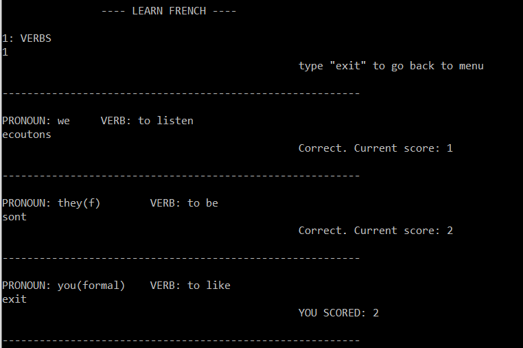

# LEARN FRENCH
Terminal-based french lerning program.

---

## How to install
1. clone repository
2. `npm install`
3. `npm run build`
4. `npm run start`

---

## Modules
### Verbs
**aim**: type the correct response to the pronoun and verb you are given, in French.
